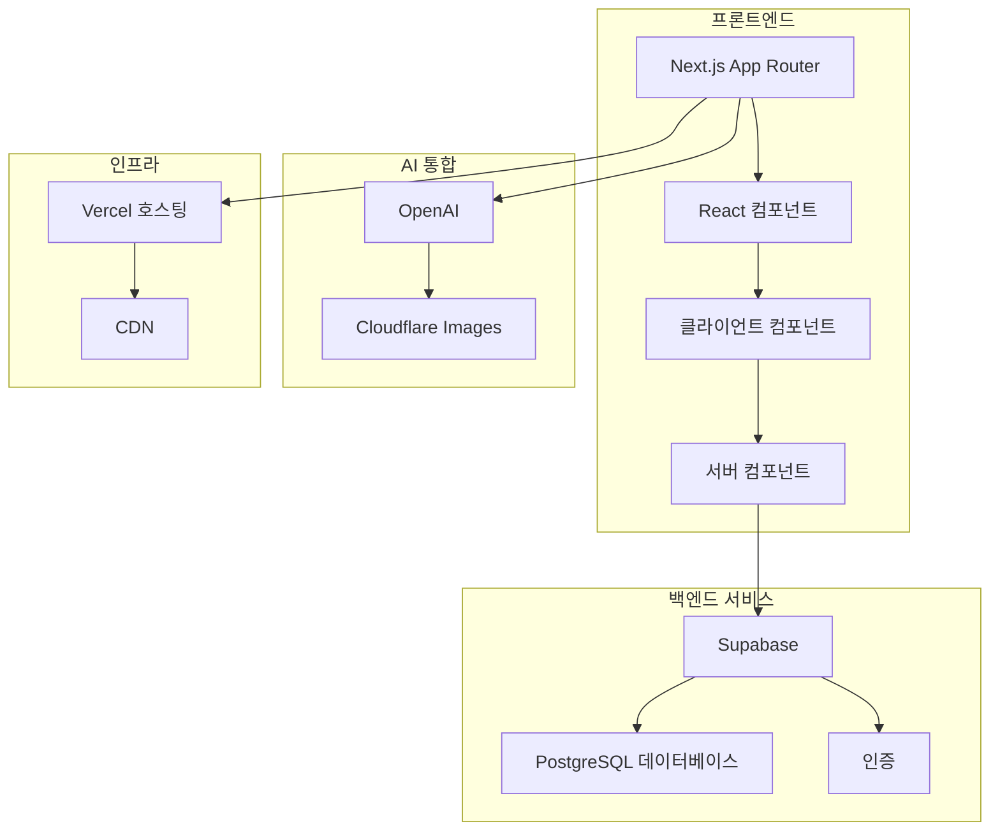

# Coffee DB

Coffee DB는 Next.js로 구축된 커피 원두 정보를 탐색하고 관리하기 위한 웹 애플리케이션입니다. TypeScript, Tailwind CSS, [shadcn/ui](https://ui.shadcn.com/)를 사용하며, 데이터는 Supabase에 저장됩니다.

## 주요 기능

*   **커피 브라우징 및 필터링**: 사용자가 다양한 커피 종류를 발견하고 탐색할 수 있도록 정교한 필터링 옵션을 갖춘 포괄적인 커피 데이터베이스입니다.
*   **AI 기반 데이터 추출**: AI 서비스와 통합하여 사용자 입력에서 커피 관련 정보를 자동으로 추출하고 처리하여 데이터 수집 프로세스를 향상시킵니다.
*   **사용자 인증**: Supabase Auth를 기반으로 구축된 안전한 인증 시스템으로 사용자 관리 및 세션 처리 기능을 제공합니다.
*   **커피 제안 시스템**: 사용자가 AI 지원 데이터 추출 및 유효성 검사를 통해 커피 제안을 제출할 수 있는 대화형 시스템입니다.
*   **명령어 팔레트 검색**: 통합된 명령어 인터페이스를 통해 사용자가 커피 관련 콘텐츠를 빠르게 탐색하고 찾을 수 있는 고급 검색 기능입니다.
*   **반응형 디자인**: 다크 모드를 지원하며 모든 기기에서 훌륭한 사용자 경험을 제공하는 반응형 레이아웃을 갖추고 있습니다.

## 기술 스택

*   **프레임워크**: [Next.js 15](https://nextjs.org/) (App Router 사용)
*   **언어**: [TypeScript](https://www.typescriptlang.org/)
*   **스타일링**: [Tailwind CSS](https://tailwindcss.com/)
*   **UI 컴포넌트**: [shadcn/ui](https://ui.shadcn.com/)
*   **백엔드 및 데이터베이스**: [Supabase](https://supabase.io/) (PostgreSQL, 인증)
*   **이미지 호스팅**: [Cloudflare Images](https://www.cloudflare.com/developer-platform/cloudflare-images/)
*   **AI**: [OpenAI](https://openai.com/)
*   **스키마 유효성 검사**: [Zod](https://zod.dev/)

## 아키텍처 개요

이 애플리케이션은 Next.js App Router 아키텍처를 사용하여 구축되었습니다. 서버 컴포넌트는 `utils` 디렉터리의 클라이언트를 사용하여 Supabase에서 데이터를 가져옵니다. 인증은 `middleware.ts`에서 동기화되며, `app/api/chat`과 같은 API 라우트가 AI 제안 워크플로우를 처리합니다. 데이터베이스 타입은 Supabase에서 생성되어 타입 안전성을 보장합니다.



## 시작하기

개발 및 테스트 목적으로 로컬 컴퓨터에서 프로젝트를 설정하고 실행하려면 다음 지침을 따르세요.

### 사전 요구 사항

*   Node.js (v18+ 권장)
*   pnpm 패키지 매니저
*   Supabase 계정 및 프로젝트
*   OpenAI API 액세스 (AI 기능용)
*   Cloudflare Images 토큰

### 설치

1.  **리포지토리 클론**
    ```bash
    git clone https://github.com/your-username/coffee-db.git
    cd coffee-db
    ```

2.  **의존성 설치**
    ```bash
    pnpm install
    ```

3.  **환경 변수 설정**
    `.env.example` 파일을 `.env.local`이라는 새 파일로 복사하고 필요한 환경 변수를 채웁니다.
    ```bash
    cp .env.example .env.local
    ```

4.  **개발 서버 실행**
    ```bash
    pnpm dev
    ```
    브라우저에서 [http://localhost:3000](http://localhost:3000)을 열어 결과를 확인하세요.

## 환경 변수

이 프로젝트를 실행하려면 `.env.local` 파일에 다음 환경 변수를 추가해야 합니다:

*   `NEXT_PUBLIC_SUPABASE_URL`: Supabase 프로젝트 URL.
*   `NEXT_PUBLIC_SUPABASE_ANON_KEY`: Supabase 프로젝트 익명 키.
*   `OPENAI_API_KEY`: AI 기능용 OpenAI API 키.
*   `CLOUDFLARE_IMAGES_TOKEN`: Cloudflare Images API 토큰.
*   `CLOUDFLARE_ACCOUNT_ID`: Cloudflare 계정 ID.
*   `CLOUDFLARE_IMAGES_HASH`: Cloudflare Images 변형 해시.


## 라이선스

이 프로젝트는 MIT 라이선스에 따라 라이선스가 부여됩니다.
