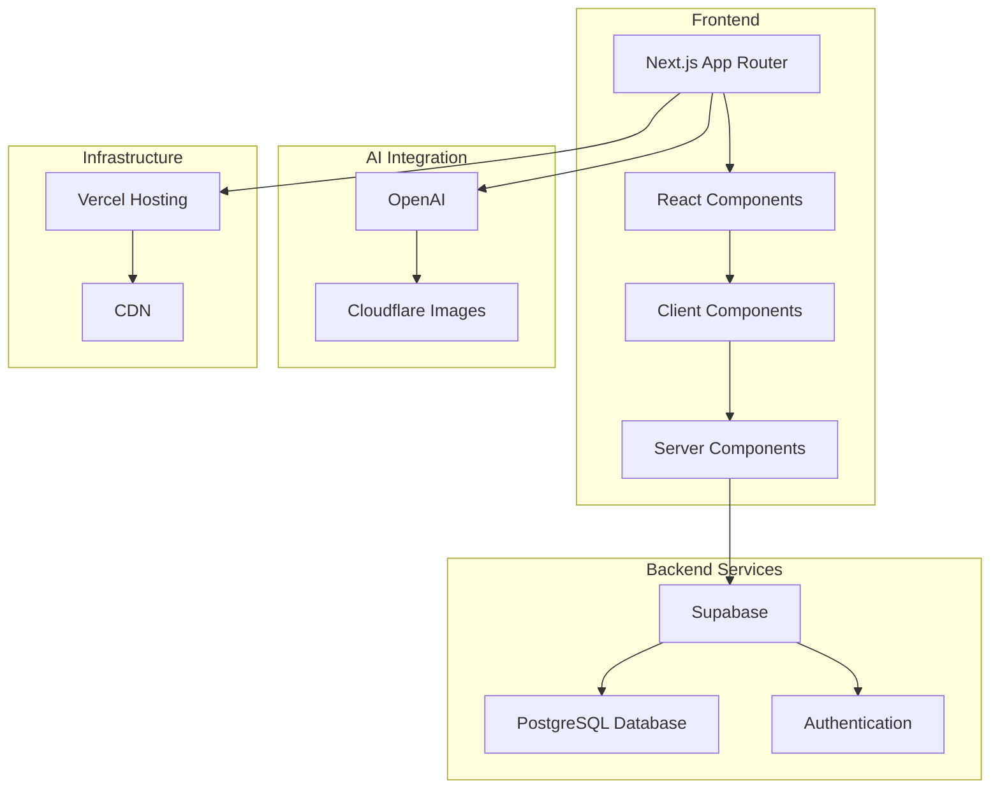
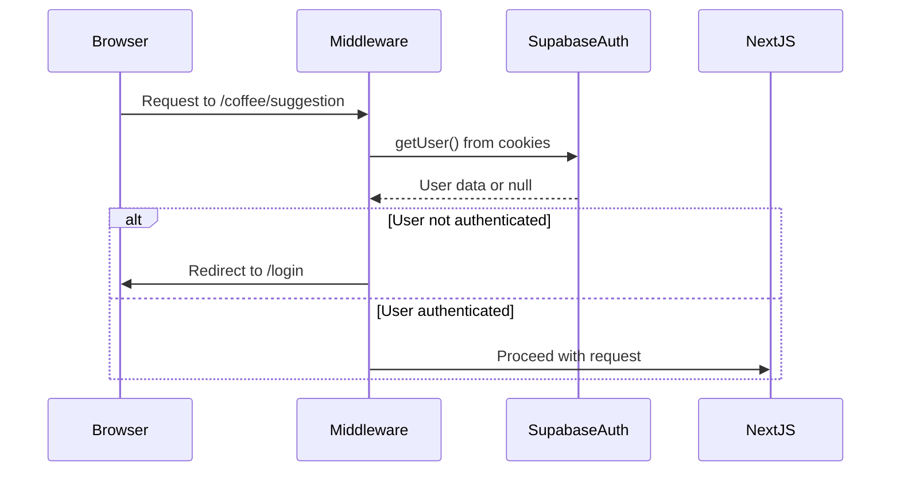

# Coffee-DB Repository Wiki

## System Overview

### Purpose and Goals

The coffee-db application is a comprehensive web platform designed to provide an intuitive interface for managing and exploring coffee-related data. Built with modern web technologies, it serves coffee enthusiasts, developers, and administrators by offering sophisticated coffee browsing, filtering, and suggestion capabilities.

### Key Features

#### Command Palette Search

Advanced search functionality that allows users to quickly navigate and find coffee-related content through an integrated command interface.

#### Coffee Browsing & Filtering

Comprehensive coffee database with sophisticated filtering options, enabling users to discover and explore different coffee varieties based on various criteria.

#### AI-Powered Data Extraction

Integration with AI services to automatically extract and process coffee-related information from user inputs, enhancing the data collection process.

#### User Authentication

Secure authentication system built on Supabase Auth, providing user management and session handling capabilities.

#### Coffee Suggestion System

Interactive system allowing users to submit coffee suggestions with AI-assisted data extraction and validation.

### Architecture Overview

The application follows a modern client-server architecture with server-side rendering capabilities:



#### Frontend Architecture

The frontend leverages Next.js 14 with App Router architecture, providing:

- Server-side rendering (SSR) for optimal performance
- Component-based UI with React 18
- TypeScript for type safety
- Tailwind CSS for utility-first styling

#### Backend Architecture

The backend follows a layered approach with:

- Supabase as Backend-as-a-Service
- PostgreSQL database
- Authentication and session management
- API routes for server-side logic

#### Data Flow

Data flows through the system using:

- Server components for initial data fetching
- Client actions for mutations
- Supabase real-time subscriptions
- AI-powered data processing

### User Workflows

#### Browsing Coffees

1. User navigates to coffee list page
2. System displays paginated coffee data
3. User applies filters for refined search
4. Results update dynamically

#### Submitting Coffee Suggestions

1. User accesses suggestion form
2. User uploads images or provides data
3. AI processes information
4. System validates and stores suggestions

#### Authentication Flow

1. User initiates login process
2. System sends OTP via email
3. User confirms authentication
4. Session established with JWT tokens

#### Searching via Command Palette

1. User activates command palette
2. System provides search interface
3. Real-time results displayed
4. Navigation to selected items

## Technology Stack

### Next.js 14 and App Router Architecture

The coffee-db application leverages **Next.js 14** with the **App Router** architecture, enabling server-side rendering (SSR), layout nesting, and route handlers. The `app` directory structure follows the modern Next.js convention, where each route segment corresponds to a folder.

Key features include:

- **Layouts and Templates**: Shared UI reused across routes with nested layouts
- **Route Handlers**: API endpoints defined using route.ts files
- **Loading and Error States**: Built-in loading.tsx and error/page.tsx files

```mermaid
graph TD
A[App Root] --> B[layout.tsx]
B --> C[page.tsx]
B --> D[coffee/]
D --> E[list/]
E --> F[page.tsx]
E --> G[loading.tsx]
D --> H[[id]/]
D --> I[suggestion/]
I --> J[page.tsx]
I --> K[_component/]
A --> L[api/chat/]
L --> M[route.ts]
```

### React 18 for Component-Based UI

**React 18** powers the UI with features like concurrent rendering and server components. The application uses functional components with hooks for state management and side effects. Client components handle interactivity, while server components optimize performance.

### TypeScript for Type Safety

**TypeScript** ensures type safety across the codebase with strict compiler options. Types are inferred from Zod schemas using `z.infer`, reducing duplication. The `database-generated.types.ts` file provides accurate database type definitions.

### Supabase for PostgreSQL and Authentication

**Supabase** serves as the backend, providing:

- PostgreSQL database
- Authentication system
- Storage capabilities
- Real-time subscriptions

The application uses two client patterns:

- **Client-Side**: `createBrowserClient` for authenticated user operations
- **Server-Side**: `createServerClient` for server actions

### Tailwind CSS for Utility-First Styling

**Tailwind CSS** enables utility-first styling with:

- **Responsive Design**: Adaptive layouts with breakpoint classes
- **Customization**: Extended themes and custom properties
- **Animation**: Transitions and animations via tailwindcss-animate

### Zod for Schema Validation

**Zod** validates data with TypeScript integration. Schemas are defined in `schema/coffee.ts` and used for both form validation and AI response parsing.

## Directory Structure

### App Directory

The main application structure following Next.js App Router conventions:

#### Home Page

- Root page (`page.tsx`) serving as the application entry point
- Layout structure defining common UI elements
- Loading and error state management

#### Layout Structure

- Root layout with theme provider and common components
- Nested layouts for specific sections
- Responsive design considerations

#### Coffee Features

- **Coffee Browsing**: List view with pagination and filtering
- **Coffee Filtering**: Advanced filter components for search refinement
- **Coffee Suggestion System**: Form-based suggestion submission with AI integration
- **Coffee Detail View**: Individual coffee information display

#### Authentication Flow

- Login page with form components
- Authentication actions and middleware
- Session management and protection

#### API Routes

- Chat API for AI integration
- Authentication confirmation endpoint
- Server-side data processing

### Components Directory

Organized component library with:

#### UI Primitives

- shadcn/ui components (buttons, forms, dialogs, etc.)
- Accessibility-compliant base components
- Themeable design system

#### Navigation Components

- Main navigation for desktop
- Mobile navigation drawer
- Active link management
- Breadcrumb navigation

#### Command Palette

- Search interface implementation
- Keyboard navigation support
- Result rendering and selection

#### Theme and Utility Components

- Theme provider and toggle functionality
- Toast notifications
- Loading indicators

### Constants Directory

Application configuration including:

- Coffee data constants
- Site configuration
- API endpoints and settings

### Data Directory

Static data files:

- `coffee.json` containing sample coffee data
- Reference data for application features

### Hooks Directory

Custom React hooks:

- `use-toast.ts` for notification management
- Reusable state management hooks

### Lib Directory

Utility functions:

- `utils.ts` with common helper functions
- Class name utilities and formatting functions

### Schema Directory

Data validation schemas:

- Zod schema definitions for coffee data
- Form validation schemas
- API response validation

### Supabase Directory

Backend configuration:

- `config.toml` for Supabase settings
- Database migration files
- Environment-specific configurations

### Types Directory

TypeScript type definitions:

- Coffee-related type definitions
- API response types
- Component prop types

### Utils Directory

Utility modules organized by functionality:

#### API Utilities

- HTTP client configuration
- Request/response handling
- Error management

#### Supabase Client Utilities

- Browser client setup
- Authentication helpers
- Database query utilities

#### Supabase Server Utilities

- Server-side client configuration
- Cookie management
- Session handling

#### Coffee Data Utilities

- Data transformation functions
- Filtering and search utilities
- Data formatting helpers

## Frontend Architecture

### Component Hierarchy

#### Root Layout Structure

The application uses a hierarchical layout system:

- Root layout with providers and global styles
- Site header with navigation and user controls
- Main content area with route-specific layouts
- Footer with additional navigation and information

#### Site Header Architecture

Complex header component with multiple features:

##### Main Navigation (Desktop)

- Primary navigation links
- Logo and branding
- User account controls

##### Mobile Navigation

- Responsive drawer menu
- Touch-friendly interface
- Collapsible navigation sections

##### Command Menu Integration

- Global search functionality
- Keyboard shortcuts
- Quick navigation

##### Theme Toggle Functionality

- Light/dark mode switching
- System preference detection
- Persistent theme state

##### Authentication-Aware UI

- Dynamic display based on auth state
- User profile information
- Login/logout controls

##### Active Link Management

- Visual indication of current page
- Dynamic styling based on route
- Accessibility features

### Server and Client Components

#### Server Components Architecture

Default server rendering for:

- Initial data fetching
- SEO optimization
- Reduced bundle size
- Better performance

#### Client Components Implementation

Interactive components with:

- State management
- Event handling
- Real-time updates
- User interactions

#### Data Flow from Server to Client

- Initial data from server components
- Prop drilling and context passing
- Client-side data mutations
- Real-time synchronization

### UI Component Patterns

#### Form Components and Validation Patterns

- React Hook Form integration
- Zod schema validation
- Error handling and display
- Accessibility compliance

#### Navigation and Overlay UI Patterns

- Modal and drawer components
- Dropdown menus and popovers
- Tooltip and hover states
- Keyboard navigation

#### Data Display and Filtering Components

- Table and list components
- Filter interfaces
- Pagination controls
- Search functionality

#### Themed UI Primitives and Accessibility Standards

- WCAG compliance
- Screen reader support
- Keyboard navigation
- Color contrast requirements

#### Loading States, Feedback, and Notification Patterns

- Skeleton loading states
- Progress indicators
- Toast notifications
- Error boundaries

### Data Fetching Strategy

#### Server Component Data Fetching

- Initial page load data
- Static generation where possible
- Server-side filtering and sorting

#### Client Actions and Mutations

- Form submissions
- User interactions
- Optimistic updates
- Error handling

#### API Route for Data Extraction

- AI-powered data processing
- Image analysis and extraction
- Validation and transformation

#### Data Caching and Performance Optimization

- Next.js built-in caching
- Supabase query optimization
- Client-side state management

## Backend Architecture

### Authentication and Session Management

The authentication system is built on Supabase Auth with middleware-based session management:

#### Authentication Flow

1. **Middleware-based Session Checking**: Intercepts all requests to verify authentication status
2. **Protected Route Enforcement**: Redirects unauthenticated users to login
3. **Password-based Authentication**: Email/password authentication via Supabase



### API Endpoints

#### Chat API

AI-powered data extraction endpoint:

- Processes user input and images
- Integrates with OpenAI services
- Returns structured coffee data
- Validates responses against schemas

#### Authentication API

Handles authentication flows:

- Email OTP verification
- Session establishment
- Token refresh
- User profile management

### Database Interactions

Supabase integration patterns:

- Row Level Security (RLS) policies
- Real-time subscriptions
- Optimistic updates
- Transaction management

## API Reference

### Chat API

**Endpoint**: `/api/chat`

- **Method**: POST
- **Purpose**: AI-powered coffee data extraction
- **Input**: User text and/or images
- **Output**: Structured coffee information
- **Authentication**: Required

### Authentication API

**Endpoint**: `/auth/confirm`

- **Method**: GET
- **Purpose**: Email OTP verification
- **Parameters**: token_hash, type, next
- **Redirect**: Success or error pages

### Supabase Client API

Database operations through Supabase:

- User authentication
- Coffee data CRUD operations
- Real-time subscriptions
- File uploads and storage

## Data Model

### Zod Schema Definition

Coffee data validation schema:

```typescript
export const coffeeSchema = z.object({
  name_en: z.string().min(1),
  name_ko: z.string().optional(),
  notes: z.array(z.string()),
  roasting_level: z.string(),
  processing_method: z.string(),
  region: z.string(),
  farm: z.string().optional(),
  variety: z.string().optional(),
  altitude: z.string().optional(),
  harvest_period: z.string().optional(),
});
```

### TypeScript Type Definitions

Inferred types from Zod schemas:

- `Coffee` type for coffee entities
- `CoffeeSuggestionForm` for form data
- Database types from Supabase generation

### Supabase Database Schema

PostgreSQL database structure:

- Coffee table with comprehensive attributes
- User management tables
- Authentication and session storage
- File storage references

### Sample Data Structure

Example coffee data format:

```json
{
  "name_en": "Ethiopian Yirgacheffe",
  "name_ko": "에티오피아 예가체프",
  "notes": ["floral", "citrus", "bright"],
  "roasting_level": "light",
  "processing_method": "washed",
  "region": "Yirgacheffe",
  "variety": "Heirloom",
  "altitude": "1800-2000m"
}
```

## Authentication System

### Login Implementation

- Email/password authentication
- OTP verification system
- Session establishment with JWT
- Error handling and validation

### Session Management

- HTTP-only cookie storage
- Automatic token refresh
- Middleware-based protection
- Logout and cleanup

### Authentication Integration with UI

- Conditional rendering based on auth state
- Protected routes and redirects
- User profile display
- Permission-based feature access

## Environment Configuration

### Required Environment Variables

- `NEXT_PUBLIC_SUPABASE_URL`: Supabase project URL
- `NEXT_PUBLIC_SUPABASE_ANON_KEY`: Supabase anonymous key
- `OPENAI_API_KEY`: OpenAI API key for AI features
- `CLOUDFLARE_IMAGES_TOKEN`: Cloudflare Images token

### Development Setup

1. Clone repository
2. Install dependencies with `pnpm install`
3. Configure environment variables
4. Run development server with `pnpm dev`

### Production Deployment

- Build with `pnpm build`
- Deploy to Vercel (recommended)
- Configure production environment variables
- Set up domain and SSL

## Getting Started

### Prerequisites

- Node.js (v18+ recommended)
- pnpm package manager
- Supabase account and project
- OpenAI API access (for AI features)

### Installation Steps

1. **Clone the repository**

   ```bash
   git clone <repository-url>
   cd coffee-db
   ```

2. **Install dependencies**

   ```bash
   pnpm install
   ```

3. **Environment configuration**

   - Copy `.env.example` to `.env.local`
   - Fill in required environment variables
   - Configure Supabase project settings

4. **Database setup**

   - Run Supabase migrations
   - Set up Row Level Security policies
   - Import sample data if needed

5. **Start development server**
   ```bash
   pnpm dev
   ```

### Project Structure Navigation

Understanding the codebase structure is essential for effective development and maintenance of the coffee-db application.